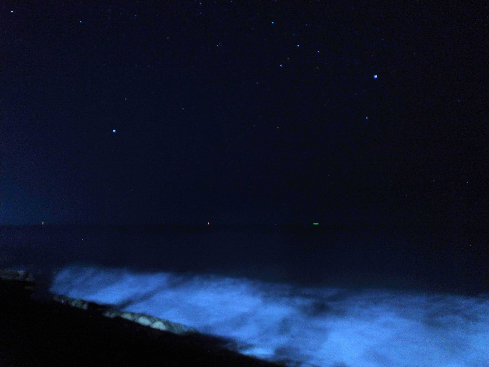

## Prologue

I'd like to assume that you're having a bad day.

Heck, maybe you're feeling like your life is just a piece of nothingness.

Or even worse, you're feeling that life's not worth living.

The fact is at some point in our life, we'll think about that. Eventually, the thought that we're nothing compared to this universe and all it's glory will make us think that nothing matters. Or simply, you come to this thought because you're having a series of bad things happening on your life, and you'd like to simple think about stuffs rationally. Well, in this post I just wanna share my thoughts on this matter. Because I've been there.

## Monologue

Let's start with how did I get that thought. The thought that I am just a spect of dust; a nothingness.

TL;DR

I was having a retreat for my catechization (in bahasa Indonesia: _katekisasi_) at South Sulawesi. It was kinda far from Makassar, the provincial kapital of South Sulawesi. So you can imagine that there is not to many life there. There, only me, my catechization friends, and our facilitator that stayed on that villa for the night. Long story short, it was night. We (the people that are doing catechization) was being asked to talk to the facilitator one by one. While waiting for my turn, I got bored. It was around 11 pm. I stayed away (to respect the privacy of my friend) and explored the villa. At some point, I heard a wave. I notice that I am very close to a beach. Imagine the sound of the wave at the middle of the night and looking at the never ending horizon. I looked above and see that there was so many stars. Here, I got an ephiphany that I was just a mere human that cannot control a lot of things. The nature that I am having is very limited to space and time. I took some pictures and be grateful to God that He sent His Son to die for me (at least this is what I believe. Feel free to think so if you have your own faith). It's that simple to know but it's very hard to appriciate it. Back to the waiting game (remember that I was waiting for my turn to talk and have a private conversation with my facilitator) I got back and talked to my friends waiting for my turn. Suprisingly because of the nature of the talk, I didn't got any chance to do so. But oh well, I do think it's interesting that my friends got that experience. It's not like I was having a problem at that time :D

 

The point is that at a beach I looked so many stars. I know that using the science that humans developed along the years that those stars are probably bigger that ours. I also know that it is probably millions, billios, or even trillions of kilometers in diameter. But the fact that it reached my eyes looking like a very small dot made me realize that those enormous stars are **_very very far_**. Sometimes you can't comprehend it and take that for granted right. Here, I am assuming that you believe that there is a _prima causa_ (the first "entity" to cause everything). If there is such an entity, well I think that this entity is just very big. And the fact that I am a christian, my personal statement states that my God (the one who created) this gigantic universe sent His Son to die at the cross for me. Does this paragraph made you feel small and big at the same time?

This is the feeling that I am still getting to this day. The fact that I am just an ordinary person living on this not so-big planet, revolving around an average star made me realize that I am nothing. But, I do realize that a God is always with me. No matter the circumstance, He's always with me. You might ask, "How could you know?" To that question, I will answer that I feel it. How do I feel it? In my life. There's always a thing that made me survive the day. A simple example is that everytime I take the elevator, it never fails. Another example is that when I cross the road, all those cars slowed down for me. There could be a day where my "luck" goes out right? But the fact that I'm here, made me thankful for today. I don't know about you but I think it's beautiful.

## Epilogue

Yes, we've come to an end. I just want you to know that if you're having a hard problem in your life, remember that a higher power is there. I don't wanna talk about which faith that you're having, but I just like you to know that life's worth living. Don't be scared to talk about your problems to the people around you. Most of them be happy to talk about it. Remember that it is often in the darkest skies that we see the brightest stars ✨. Seriously tho, I found that by being in the dark moments in life that I personally met my creator. It's not like I see Jesus in my dream or something like that. It's just I feel it. I feel that joy everyday when I know that things are not going too well for me. You just see lots of stars on those darkest skies. On mine darkest skies, I found my new hobby, which is table tennis. It was fun to play with my friends. Trash talking is one of thing that I likes to do. The joy that you get from those kind of moments really made me realize that everything is under control. Not yours, but your creator.
